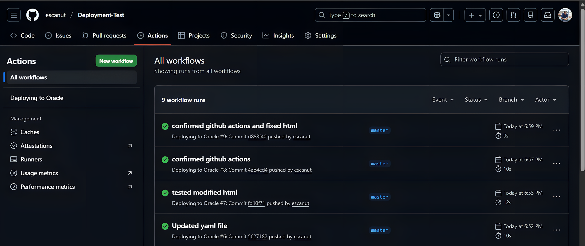
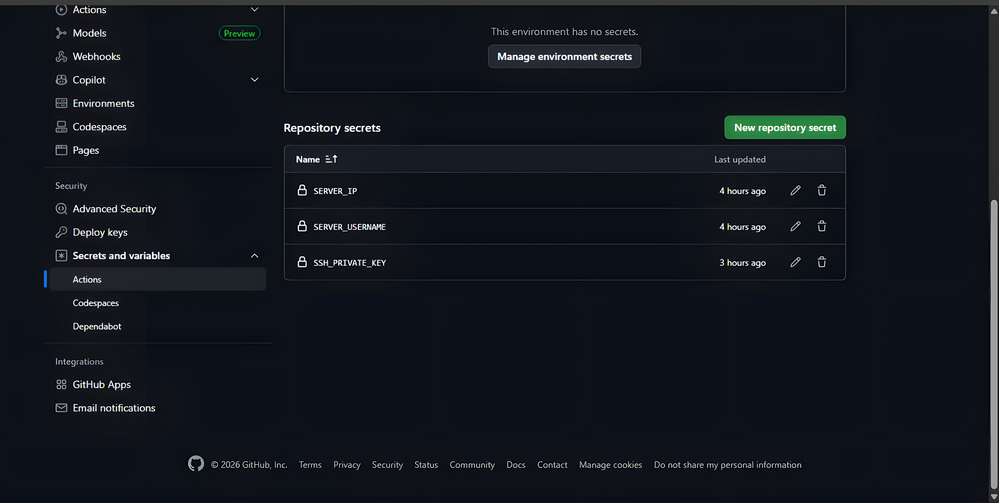
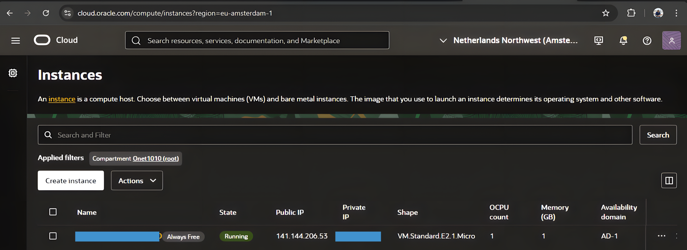
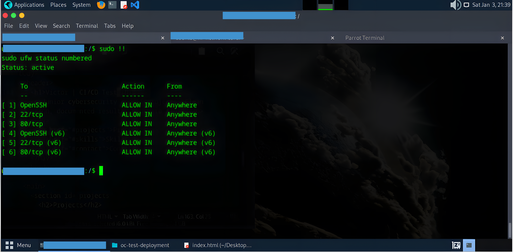
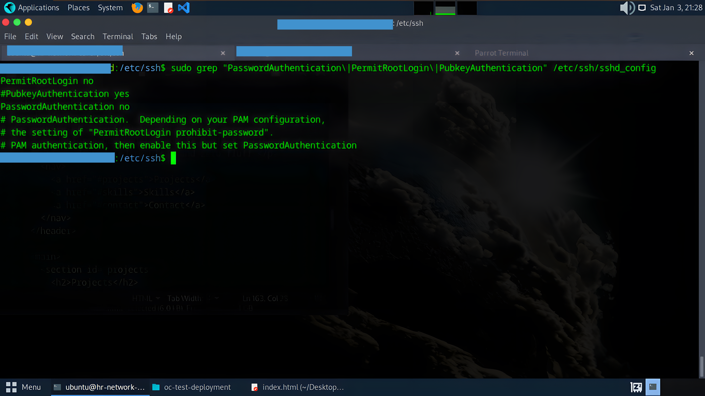
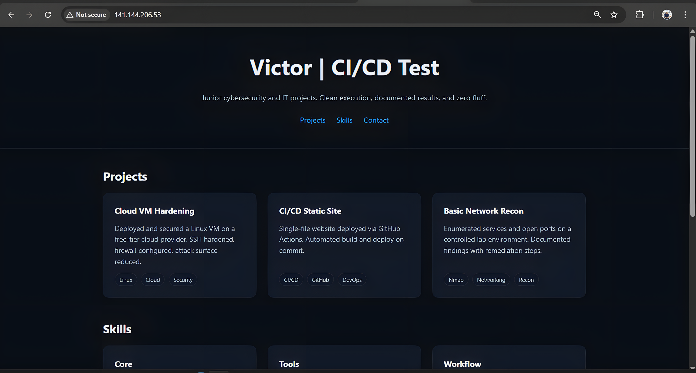
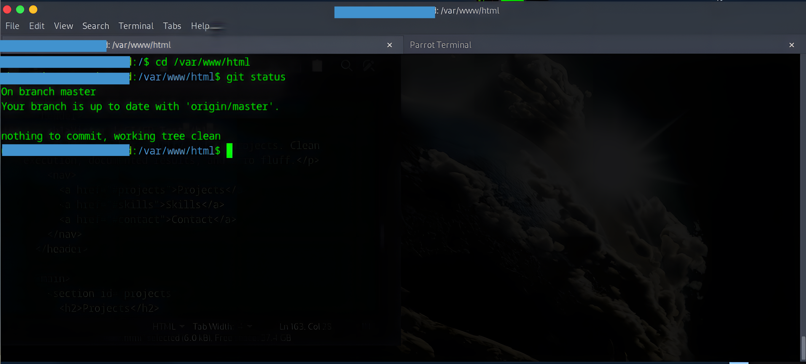

## Overview

This project implements continuous deployment for a static website hosted on Oracle Cloud Infrastructure. The pipeline uses GitHub Actions to automatically deploy code changes via SSH, eliminating manual intervention while maintaining security controls.


---

## Architecture

```
Developer Workstation
        ↓
   Git Push (HTTPS)
        ↓
GitHub Repository (master branch)
        ↓
GitHub Actions Runner (Ubuntu Latest)
        ↓
SSH Connection (ED25519 Key Auth)
        ↓
OCI Compute Instance (VM.Standard.E2.1.Micro)
        ↓
Nginx Web Server (/var/www/html)
```

---

## Infrastructure

**Cloud Platform:** Oracle Cloud Infrastructure (OCI)  
**Compute:** VM.Standard.E2.1.Micro (Always Free tier)  
**Operating System:** Ubuntu 24.04 LTS  
**Web Server:** Nginx  
**Region:** Netherlands Northwest (Amsterdam)  

**Network Configuration:**
- Public IP: Assigned
- Security List: Custom ingress rules
- VCN: Default OCI configuration

---

## Security Controls

### SSH Hardening
- **Password Authentication:** Disabled
- **Root Login:** Prohibited
- **Public Key Authentication:** Required (ED25519)

### Firewall Configuration (UFW)
- Port 22 (SSH): Allowed from anywhere
- Port 80 (HTTP): Allowed from anywhere
- Port 80 (HTTP IPv6): Allowed from anywhere
- Default Policy: Deny incoming, allow outgoing

### Access Control
- GitHub Actions authentication via encrypted secrets
- SSH private key stored in GitHub repository secrets
- Server credentials never exposed in workflow files

---

## CI/CD Pipeline

### Workflow Trigger
```yaml
on:
  push:
    branches: [ master ]
```

### Deployment Process
1. GitHub detects push to master branch
2. Workflow spins up Ubuntu runner
3. SSH connection established using private key from secrets
4. Commands execute on remote server:
   - Navigate to web directory
   - Pull latest code from GitHub
   - Reload Nginx (zero downtime)
5. Changes live within 10-15 seconds

### Secrets Configuration
Three repository secrets required:
- `SSH_PRIVATE_KEY`: ED25519 private key for authentication
- `SERVER_IP`: OCI instance public IP
- `SERVER_USER`: SSH username

---

## Deployment Evidence

### Successful Pipeline Execution

*Multiple successful deployments showing consistent 9-12 second execution times*

### Repository Secrets

*Encrypted credentials stored securely in GitHub*

### Infrastructure Status

*Always Free tier compute instance in running state*

### Security Configuration

*Active firewall with restrictive ingress rules*


*Hardened SSH configuration with password authentication disabled*

### Live Deployment

*Deployed website accessible via public IP*

### Git Repository Status

*Clean working tree synced with remote repository*

---

## Technical Implementation

### GitHub Actions Workflow
Location: `.github/workflows/deploy.yml`

The workflow uses GitHub's hosted runners to establish SSH connections and execute remote commands. All commands run within a single SSH session to maintain context and reduce connection overhead.

### Server Configuration
- Web root: `/var/www/html`
- Git repository: Cloned directly into web root
- Nginx: Reloads configuration on each deployment

---

## Performance Metrics

Based on production deployment data:

| Metric | Value |
|--------|-------|
| Average Deployment Time | 10-12 seconds |
| Successful Deployments | 9/9 shown |
| SSH Connection Time | < 2 seconds |
| Git Pull Time | < 3 seconds |
| Nginx Reload Time | < 1 second |


This deployment uses one compute instance with standard storage allocation.

---

## Operational Considerations

### Monitoring
- GitHub Actions provides execution logs for all deployments
- Nginx access and error logs available on server
- UFW logs track connection attempts

### Backup Strategy
Git serves as the primary backup mechanism. Full repository history maintained on GitHub with the ability to roll back to any previous commit.

---

## Reproduction Steps

### Prerequisites
- Oracle Cloud account (Always Free tier)
- GitHub account
- SSH key pair (ED25519 recommended)
- Basic Linux command line knowledge

### Setup Process
1. Provision OCI compute instance (Ubuntu 24.04)
2. Configure security list for HTTP/HTTPS traffic
3. Harden SSH configuration
4. Enable UFW firewall
5. Install Nginx and Git
6. Clone repository to `/var/www/html`
7. Generate deployment SSH key pair
8. Add public key to server's `authorized_keys`
9. Store private key and credentials in GitHub secrets
10. Create GitHub Actions workflow file
11. Push to master branch to test deployment

---

## Technologies Used

- **Cloud:** Oracle Cloud Infrastructure (OCI)
- **CI/CD:** GitHub Actions
- **Web Server:** Nginx
- **Operating System:** Ubuntu 24.04 LTS
- **Security:** UFW, SSH key authentication
- **Version Control:** Git, GitHub

---

## Project Context

This deployment demonstrates practical DevOps implementation suitable for client environments requiring automated deployments without enterprise tooling complexity. The architecture scales to support multiple sites on a single instance or can be replicated across multiple instances for different applications.

The security posture aligns with standard cloud infrastructure requirements including SSH hardening, firewall configuration, and credential management through encrypted secrets.

---

